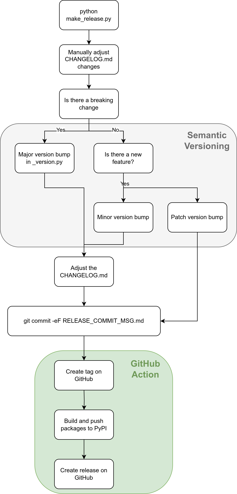

# 发布

`pypdf` 的发布包含以下内容：

* 一个新的 [PyPI 上的发布](https://pypi.org/project/pypdf/)
* 一个 [发布提交](https://github.com/py-pdf/pypdf/commit/91391b18bb8ec9e6e561e2795d988e8634a01a50)
    * 包含更新的 changelog
    * 一个新的 [git 标签](https://github.com/py-pdf/pypdf/tags)
        * 一个 [GitHub 发布](https://github.com/py-pdf/pypdf/releases/tag/3.15.0)

## 谁来发布？

`pypdf` 通常应该由核心维护者或核心维护团队成员发布。目前，这些人包括 Martin Thoma、pubpub-zz 和 stefan6419846。

任何拥有 py-pdf 组织所有权的人也有技术权限进行发布。

## 如何发布？

### 使用直接推送权限

这是核心维护者或仁慈独裁者的典型方式。

发布过程包括以下步骤：

1. 通过 `python make_release.py` 更新 `CHANGELOG.md` 和 `_version.py`，同时准备发布提交消息。
2. 创建发布提交：`git commit -eF RELEASE_COMMIT_MSG.md`。
3. 推送提交：`git push`。
4. CI 现在构建源包和轮子包，并将其推送到 PyPI。它还会创建相应的标签和 GitHub 发布。

### 使用拉取请求

这是协作者的典型方式，适用于没有 `main` 分支直接推送权限的人。

发布过程包括以下步骤：

1. 通过 `python make_release.py` 更新 `CHANGELOG.md` 和 `_version.py`，同时准备发布提交消息。
2. 将更改推送到专用分支。
3. 打开一个拉取请求，标题以 `REL: ` 开头，后跟新版本号。
4. 等待其他符合条件的维护者审批。
5. 合并拉取请求，合并后的提交消息使用 PR 标题，正文使用 `RELEASE_COMMIT_MSG.md` 的内容。
7. CI 现在构建源包和轮子包，并将其推送到 PyPI。它还会创建相应的标签和 GitHub 发布。

### 发布标签

* 使用发布版本作为标签名称，无需加前缀 "v"。
* 使用 changelog 条目作为标签的正文。

## 什么时候发布？

无需等待任何事情。如果 CI 测试通过（所有测试成功），我们就可以发布。

我（Martin Thoma）通常每周发布一次，因为发布过程需要花费一些时间，我不想用太多的发布来打扰用户。